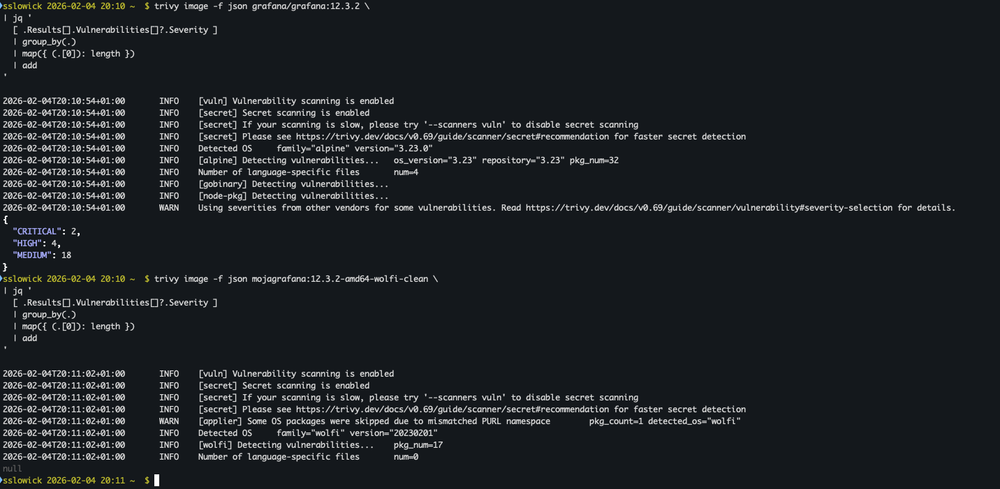

# devops-hardcore - Grafana
Images without CVE - Secure by design. (Wolfi, Melange, Apko)

###  🪳🔥❌ 0. CVE na dzień 04.02.2026 godz: 20:10

Grafana pobrana z dockerhub vs podejście devops-hardcore.

<details>
  <summary><strong>📊 Vulnerability report (Trivy)</strong></summary>

  <br>

  

</details>

<span style="color:#d32f2f; font-weight:600">
Jest to standard stosowany w świecie finansów, bankach i wielkich korporacjach. Zero CVE. 0, zero kompromisów.
</span>

###  🆕 1. Wstęp: Dlaczego nie zwykły Dockerfile?
Większość obrazów Dockerowych budujemy instrukcjami FROM ubuntu lub FROM alpine, a potem RUN apt-get install... To podejście ma wady:

- Dług ogona (CVE): Dziedziczymy setki bibliotek systemowych, których nasza aplikacja nie potrzebuje, a które mają luki bezpieczeństwa.

- Brak determinizmu: apt-get update dzisiaj może pobrać inną wersję pakietu niż tydzień temu.

- Rozmiar: Obrazy puchną od zbędnych plików (cache, logi, zbędne binarki).

🗽 Rozwiązanie: Przechodzimy na ekosystem Chainguard Wolfi. Używamy dwóch narzędzi:

*Melange*: Do zbudowania naszej aplikacji jako czystego pakietu systemowego (.apk).

*Apko*: Do złożenia finalnego obrazu OCI z klocków (pakietów), bez użycia RUN, COPY czy powłoki systemowej.


### 0️⃣ 2. Krok Zero: Klucze RSA

local-melange.rsa (Klucz prywatny)

local-melange.rsa.pub (Klucz publiczny)

Po co to jest? W tym ekosystemie bezpieczeństwo opiera się na kryptografii.

Melange używa klucza prywatnego, aby cyfrowo podpisać zbudowany pakiet (.apk). To gwarancja: "Ja, zespół DevOps, zbudowałem ten pakiet i nikt go nie zmienił".

Apko używa klucza publicznego, aby zweryfikować ten podpis przed zainstalowaniem pakietu w obrazie. Jeśli podpis się nie zgadza, Apko odmówi budowy.

Ważne: Klucz prywatny nigdy nie powinien trafić do repozytorium Git (chyba że jest zaszyfrowany, np. w git-crypt lub jako secret w CI/CD). Klucz publiczny musi być dostępny dla procesu budowania obrazu.

Generowanie kluczy (jednorazowo):

`docker run --rm -v "$(pwd):/work" cgr.dev/chainguard/melange keygen local-melange.rsa`

### 🪓⚔️🪠 3. Melange: Budowanie Pakietu (melange.yaml) - wprowadzenie:
Melange nie buduje obrazu kontenera. Melange buduje artefakt (paczkę instalacyjną). Traktuj to jako nowoczesny odpowiednik rpmbuild lub tworzenia paczek .deb, ale w pełni deklaratywny i wyizolowany.

Analiza pliku melange.yaml **(Case Study: Grafana)**
Oto szczegółowa analiza, dlaczego ten plik wygląda tak, a nie inaczej. Każda sekcja ma swoje krytyczne uzasadnienie.

#### Sekcja A: Metadane
YAML
```
package:
  name: grafana-custom
  version: 12.3.2
  epoch: 2
  target-architecture:
    - all
```
epoch: To licznik "poprawek pakietowania". Jeśli wersja aplikacji (12.3.2) się nie zmienia, ale my zmieniliśmy coś w sposobie budowania (np. dodaliśmy flagę kompilacji), podbijamy epoch. Dzięki temu system wie, że to nowsza paczka tej samej wersji softu.

#### Sekcja B: Environment (Środowisko Budowania)
YAML
```
environment:
  contents:
    repositories:
      - https://packages.wolfi.dev/os
    packages:
      - wolfi-base
      - go
      - make
      - git
      - build-base  # Zawiera kompilatory C, linkery itp.
      - curl
```
Co tu się dzieje? To definicja "Buildera". Melange tworzy tymczasowy, pusty kontener i instaluje w nim tylko te narzędzia.

Dlaczego? Zapewnia to czystość. Nie ma tu przypadkowych bibliotek, które mogłyby wpłynąć na kompilację. Po zbudowaniu pakietu to środowisko jest niszczone – te narzędzia (go, git,curl ) nie trafiają do finalnego obrazu produkcyjnego, "są potrzebne tylko do wyprodukowania (zbudowania) paczki".

##### Sekcja C: Pipeline (Serce procesu)
To jest skrypt wykonywany wewnątrz środowiska budowania. Tu definiujemy logikę "jak to zbudować". Czy każda aplikacja wymaga innej? TAK. To jest najtrudniejsza część, wymagająca wiedzy o budowanym sofcie.


### 🪓⚔️🪠 4. Melange: Budowanie Pakietu (melange.yaml) - na przykładzie Grafany 12.3.2 posiadającej CVE

##### Krok 1: Pobranie kodu
```
pipeline:
  - uses: git-checkout
    with:
      repository: https://github.com/grafana/grafana
      tag: v12.3.2
      depth: 1
```
Używamy git-checkout zamiast kopiowania plików lokalnych, aby mieć 100% pewności, że budujemy z oficjalnego taga. depth: 1 przyspiesza pobieranie (tylko ostatni commit).
**Warto sprawdzić na repo, czy tak istnieje, zanim rozpoczniemy proces budowania paczki.**

##### Krok 2: Specyfika Go i "Wire" (Backend)
```
  - name: Build Backend
    runs: |
      # 1. Instalacja narzędzia do Dependency Injection (specyfika Grafany)
      go install github.com/google/wire/cmd/wire@latest
      
      # 2. Generowanie kodu Go
      wire gen -tags oss ./pkg/server
```
Dlaczego? Grafana używa narzędzia wire, które generuje pliki .go przed kompilacją. Bez tego kroku kompilacja wywali błąd o braku plików. To przykład wiedzy specyficznej dla danej aplikacji, którą musimy "zaszyć" w pipeline.

##### Krok 3: Kompilacja i Wstrzykiwanie Wersji
```
      # Pobieramy hash commita
      COMMIT_SHA=$(git rev-parse --short HEAD)

      # Kompilacja z wstrzyknięciem flag
      go build -ldflags "-w -s -X main.version=12.3.2 -X main.commit=$COMMIT_SHA ..." -o bin/linux-amd64/grafana ./pkg/cmd/grafana
```
O co chodzi z -ldflags? Gdy budujemy aplikację "z palca" (poza oficjalnym CI producenta), binarka często nie wie, jaką ma wersję (zgłasza unknown).

-X main.version=...: To chirurgiczne wstrzyknięcie tekstu bezpośrednio do zmiennej w kodzie binarnym. Dzięki temu Grafana po uruchomieniu "wie", że jest w wersji 12.3.2.

-w -s: Odchudzanie binarki (usunięcie symboli debugowania).

##### Krok 4: Frontend (Podejście Hybrydowe)
```

  - name: Fetch Official Frontend Assets
    runs: |
      curl -L https://dl.grafana.com/.../grafana-12.3.2.linux-amd64.tar.gz -o /tmp/grafana.tar.gz
      # ... wypakowanie assets/public
```
Dlaczego nie budujemy frontendu? Budowanie frontendu Grafany wymagałoby zainstalowania Node.js, Yarn i pobrania tysięcy zależności npm. Trwałoby to dodatkowe 15 minut, ponad to często jest źródłem błędów.

Hybryda: Budujemy backend (Go) sami, aby mieć kontrolę nad bezpieczeństwem binarki serwera, ale frontend (pliki statyczne JS/CSS/HTML) bierzemy gotowy od producenta. To pragmatyczny kompromis.

##### Krok 5. Instalacja - definicja struktury paczki
```
  - name: Install
    runs: |
      mkdir -p ${{targets.destdir}}/usr/share/grafana
      cp bin/linux-amd64/grafana ${{targets.destdir}}/usr/bin/
      cp -r public ${{targets.destdir}}/usr/share/grafana/
```

${{targets.destdir}}: To "magiczna" zmienna Melange. Wszystko, co tu wrzucisz, stanie się zawartością pliku .apk. To tutaj decydujemy, gdzie pliki wylądują w systemie pliku (np. /usr/bin/).

👌 Wzorcowy plik melange.yaml

```
package:
  name: grafana-custom
  version: 12.3.2
  epoch: 2
  description: "Custom Grafana build (Hybrid with Fixed Versioning)"
  target-architecture:
    - all
  copyright:
    - license: AGPL-3.0-only

environment:
  contents:
    repositories:
      - https://packages.wolfi.dev/os
    keyring:
      - https://packages.wolfi.dev/os/wolfi-signing.rsa.pub
    packages:
      - ca-certificates-bundle
      - busybox
      - go
      - make
      - git
      - build-base
      - curl

pipeline:
  - uses: git-checkout
    with:
      repository: https://github.com/grafana/grafana
      tag: v12.3.2
      depth: 1

  - name: Build Backend
    runs: |
      export GOMAXPROCS=3
      go install github.com/google/wire/cmd/wire@latest
      export PATH=$PATH:$(go env GOPATH)/bin

      echo "Generating wire..."
      wire gen -tags oss ./pkg/server

      # Pobieramy hash commita wewnatrz kontenera
      COMMIT_SHA=$(git rev-parse --short HEAD)

      echo "Building Legacy grafana-server (compatibility)..."
      go run build.go build

      echo "Building Modern 'grafana' binary WITH VERSION FLAGS..."
      # KLUCZOWE: Wstrzykujemy wersje recznie przy kompilacji
      go build -ldflags "-w -s -X main.version=12.3.2 -X main.commit=$COMMIT_SHA -X main.buildBranch=main -X main.buildstamp=$(date +%s)" -o bin/linux-amd64/grafana ./pkg/cmd/grafana

  - name: Fetch Official Frontend Assets
    runs: |
      echo "Downloading official Grafana assets..."
      mkdir -p /tmp/official-grafana
      # Pobieramy gotowy frontend z oficjalnego wydania
      curl -L https://dl.grafana.com/oss/release/grafana-12.3.2.linux-amd64.tar.gz -o /tmp/grafana.tar.gz
      tar -xzf /tmp/grafana.tar.gz -C /tmp/official-grafana --strip-components=1
      rm -rf public
      cp -r /tmp/official-grafana/public .
      cp -r /tmp/official-grafana/conf .

  - name: Install
    runs: |
      mkdir -p ${{targets.destdir}}/usr/share/grafana
      mkdir -p ${{targets.destdir}}/usr/bin

      # Kopiujemy binarki
      cp bin/linux-amd64/grafana-server ${{targets.destdir}}/usr/bin/
      cp bin/linux-amd64/grafana ${{targets.destdir}}/usr/bin/
      cp bin/linux-amd64/grafana-cli ${{targets.destdir}}/usr/bin/

      # Kopiujemy frontend i konfigi
      cp -r public ${{targets.destdir}}/usr/share/grafana/
      cp -r conf ${{targets.destdir}}/usr/share/grafana/
```
###  🤟5. Apko: Składanie Obrazu (apko.yaml)
Mamy już zbudowany pakiet .apk. Teraz czas na Apko. Apko to narzędzie do budowania obrazów OCI (Docker images), które jest w pełni deklaratywne.
Co to znaczy? W apko.yaml nie ma instrukcji proceduralnych ("funkcja x, skopiuj plik"). Jest tylko lista zakupów: "Chcę obraz z tymi pakietami".

Analiza apko.yaml:
```
contents:
  repositories:
    - https://packages.wolfi.dev/os
    - ./packages/  # <-- Tu wskazujemy nasze lokalne repozytorium z kroku Melange
  keyring:
    - https://packages.wolfi.dev/os/wolfi-signing.rsa.pub
    - ./local-melange.rsa.pub # <-- Klucz publiczny, by ufać naszej paczce
  packages:
    - wolfi-base             # Minimalny system plików
    - ca-certificates-bundle # Niezbędne do połączeń HTTPS
    - grafana-custom         # <-- NASZA APLIKACJA
```

Zalety podejścia Apko:

- SBOM (Software Bill of Materials): Apko automatycznie generuje pliki SBOM (sbom-x86_64.spdx.json). To pełna lista składników oprogramowania – wymagane w nowoczesnych korporacjach i audytach bezpieczeństwa.
- Brak zbędnych śmieci: W wynikowym obrazie nie ma menedżera pakietów (apk jest usunięte). Atakujący nie może zrobić apk install curl, żeby pobrać wirusa, bo apk po prostu nie istnieje.
- Szybkość: Apko nie "instaluje" pakietów w tradycyjnym sensie. On po prostu rozpakowuje pliki .apk do warstw obrazu. To trwa sekundy.

Przykład wzorcowy apko.yaml na przykładzie grafany 12.3.2

```
contents:
  repositories:
    - https://packages.wolfi.dev/os
    # Wskazujemy Twój lokalny folder z paczkami
    - ./packages
  keyring:
    - https://packages.wolfi.dev/os/wolfi-signing.rsa.pub
    # Twój klucz publiczny
    - ./local-melange.rsa.pub
  packages:
    - wolfi-base
    - ca-certificates-bundle
    - grafana-custom
    - tzdata

accounts:
  groups:
    - groupname: grafana
      gid: 472
  users:
    - username: grafana
      uid: 472
      gid: 472
  run-as: 472

paths:
  - path: /var/lib/grafana
    type: directory
    permissions: 0775
    uid: 472
    gid: 472
    recursive: true
  - path: /var/log/grafana
    type: directory
    permissions: 0775
    uid: 472
    gid: 472
    recursive: true
  - path: /usr/share/grafana
    type: directory
    permissions: 0755
    uid: 472
    gid: 472
    recursive: true

entrypoint:
  command: /usr/bin/grafana-server --homepath=/usr/share/grafana --config=/usr/share/grafana/conf/defaults.ini --packaging=docker cfg:default.paths.logs=/var/log/grafana cfg:default.paths.data=/var/lib/grafana cfg:default.paths.plugins=/var/lib/grafana/plugins

archs:
  - amd64
```
### 🥷🏻 6. Zróbmy to razem na podstawie przygotowanych plików yaml:

0. Przechodzimy do katalogu: 
```
cd wolfi-grafana
```

1. Wygeneruj klucze, jeżeli ich jeszcze nie masz:

```
docker run --rm -v "$(pwd):/work" cgr.dev/chainguard/melange keygen local-melange.rsa
```

2. Budowa `.apk` Melange - (trochę trwa i mocno zjada RAM):

```
docker run --rm --privileged \
  -v "$(pwd):/work" \
  cgr.dev/chainguard/melange build melange.yaml \
  --arch amd64 \
  --signing-key local-melange.rsa
```

Co się dzieje: Kod jest pobierany, kompilowany w bezpiecznym kontenerze, podpisywany Twoim kluczem prywatnym.

Wynik: Plik `.apk` w folderze `./packages`.

Chcesz sprawdzić czy proces nadal trwa? Sprawdź wolny RAM LIVE:

Weryfikacja LIVE na innej konsoli:

linux: `watch -n 1 free -m`

zsh (macbook): 
```
watch -n 1 "vm_stat | awk '/Pages free/ {free=\$3} /Pages active/ {active=\$3} /Pages inactive/ {inactive=\$3} /Pages wired down/ {wired=\$4} END {pagesize=$(sysctl -n hw.pagesize); printf \"Free: %d MB, Used: %d MB\n\", free*pagesize/1024/1024, (active+inactive+wired)*pagesize/1024/1024}'"
```

3. Uruchom Apko z plikiem apko.yaml. 

```
docker run --rm -v "$(pwd):/work" \
  cgr.dev/chainguard/apko build apko.yaml \
  mojagrafana:12.3.2-amd64-wolfi-clean \
  grafana-openshift.tar \
  --arch amd64
```

Co się dzieje: Apko bierze Twój plik `.apk`, dorzuca minimalny system Wolfi i pakuje to w format Dockera.

Wynik: Plik `.tar` (obraz Dockera) + SBOM.

4. Załaduj obraz do lokalnego Dockera: 

`docker load < grafana-openshift.tar`

5. Przetestuj lokalnie: 

```
docker run -d \
  --name moja-grafana \
  --rm \
  --platform linux/amd64 \
  -p 3000:3000 \
  mojagrafana:12.3.2-amd64-wolfi-clean
```

---
### ✍️ Autor
**[mgr inż. Szymon Słowicki](https://www.linkedin.com/in/szymonslowicki/)** – DevOps Engineer @ Pentacomp Systemy Informatyczne
🥷🏻 wKonenerach.pl #wKonenerachArmy